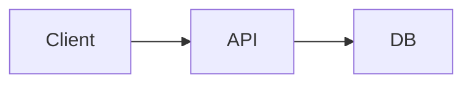

# Diagrams & Playground

Inferenesia keeps visual work next to coding: **Mermaid** in chat and the **Playground** gallery, **HTML playgrounds**, **Image Studio**, and **Excalidraw** files for freeform boards.

## Playground (hub)

Open the **Playground** item in the activity rail.

| Area | What you get |
|------|----------------|
| **List** | HTML, Diagram, and **Image** items from **live sessions** and **Library** |
| **Filters** | All / HTML / Diagram / Image / (other kinds as they ship) |
| **Create** | Pick a type → wizard: **title**, **No session (Library)** (default), or a **chat session** |
| **Context menu** | Open · Rename · Open session (if not Library) · Delete |
| **HTML detail** | Device frames, Preview/Code, live iframe, ephemeral instruction bar |
| **Diagram detail** | Full Mermaid editor, DSL chips, ephemeral instruction bar |
| **Image Studio** | Generate / edit images with size picker, refs, history strip |

**Library** playgrounds use the `global` scope. Creating with **No session (Library)** keeps generate/edit prompts **out of chat session history**. Choosing a session scopes the playground to that thread so agents can use its context when you generate with a bound `workspace_id`.

Timestamps on list rows are **playground last content update**, not “last chat message in that session”.

While Playground is open, the footer shows `playground: Library` or `playground: <session>`. The shell status bar does **not** show git branch, dirty counts, or SCM actions — use the **Git** panel for that.

### Device frames (HTML)

Preview scales the **whole phone/tablet chrome** (screen size + bezel) to fit the stage. Mobile content stays **inside** the mockup. Devices: Mobile 390×844, Tablet 768×1024, Laptop 1280×800, Desktop 1440×900.

## Image Studio

Ready kind: **Image** (create grid or filters).

| Control | Role |
|---------|------|
| **Size** select | Opens a modal: Landscape / Portrait / Square / **Paper** (A4, A3, Letter, Legal, Tabloid, portrait & landscape). Button label e.g. `Square - 1:1`, `Paper - A4` |
| **Temperature / Thinking / Output** | Image+text vs image only; sampling; reasoning effort |
| **Use as ref** | Checkbox: send the **currently previewed** history image as a reference on the next generate |
| **History** (left rail) | Click = preview that version; **double-click** past version = restore as current; 4:3 thumbs |
| **Generate** | Uses the model from the **ModelPicker** (same as chat). Prompt field clears after a successful generate so the placeholder returns |

**Library Image Studio** sends `ephemeral: true` and **no** `workspace_id`, so turns are **not** written into an active session (e.g. Donor Darah). Session-scoped Image Studio passes that session’s id and may continue chat context.

Right-click the result image: **Preview fullscreen**, **Download**, **Copy user prompt**, **Copy agent prompt** (the expanded prompt that was actually sent for that generate).

## Mermaid in chat

When an assistant message includes a Mermaid fence, the bubble can render the diagram:

````markdown

````

Use zoom, diagram style (follows app theme by default), and export. Completed fences from sessions can also be **indexed** into Playground as Diagram items.

## AI edit on HTML / diagram (gallery)

The bottom instruction bar is **ephemeral** (not session chat history).

For normal requests (“change the navbar”, “rename one node label”), Inferenesia expects **patches**, not a full rewrite:

```
<<<<<<< SEARCH
[exact snippet from the current playground]
=======
[replacement]
>>>>>>> REPLACE
```

The app applies those patches to the current document. While generating, you can switch to another playground; **Generating** is per playground.

## Excalidraw files

Files ending in `.excalidraw` open on the visual **canvas** with a **Source** view for raw JSON when needed. Save when dirty.

## Mermaid vs HTML vs Image Studio vs Excalidraw

| Prefer Mermaid | Prefer HTML playground | Prefer Image Studio | Prefer Excalidraw |
|----------------|------------------------|---------------------|-------------------|
| Flow/sequence in chat or gallery | Live UI mock | Generated / ref-edited stills | Freeform whiteboard |
| Export SVG/PNG | Device frames + code | Size/paper, history, refs | File in the repo |
| Indexed into Playground | Library or session scope | Library or session scope | Repo file |

## Tips

- Prefer small, explicit edit instructions so patch mode can keep structure.
- After Image Studio generate, confirm the footer still says **playground: Library** if you chose no session.
- Keep secrets out of diagram labels, HTML copy, and image prompts.
- Use **Rename** from the list context menu when the auto title is wrong.

## Common mistakes

| Mistake | Better |
|---------|--------|
| Expecting session chat to rewrite a Library playground | Use the playground instruction bar / Image Studio, or open the Library item |
| Leaving an old hub binary running after an image-gen fix | Rebuild/restart `inferenesia-desktop` so core ephemeral rules apply |
| Assuming list time = last chat | List shows playground content `updatedAt` |
| Using **Use as ref** without checking the previewed history item | Preview the version you want, then check **Use as ref** |

## Next

- [Case studies](case-studies) — playground walkthroughs
- [Chat & models](chat-models) — model picker shared with Image Studio
- [Git](git) — commit diagrams and assets with code
